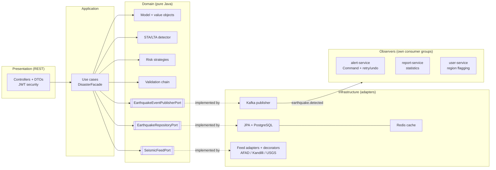

# Earthquake & Disaster Monitoring Platform

A full-stack seismic monitoring system. Raw station signals are run through an **STA/LTA
detector**; detected events are risk-scored (**Strategy**), persisted, and fanned out over
Kafka (**Observer**). The same detection core ships in two deployment shapes: a clean
**hexagonal monolith** and an **event-driven microservices** split. Both are explored through
a purpose-built **React + MapLibre** web console.

The codebase is organized around clean architectural seams and ten classic design patterns
(Strategy, Factory, Adapter, Observer, Builder, Template Method, Chain of Responsibility,
Command, Decorator, Facade), following SOLID.

## Repository layout

This is a monorepo with three independent projects, each with its own detailed README:

| Project | What it is | Stack | Runs on |
|---|---|---|---|
| [`earthquake-monitoring`](earthquake-monitoring) | Detection backend as a single deployable. Hexagonal (ports & adapters). | Spring Boot 3, PostgreSQL, Redis, Kafka | `:8081` |
| [`earthquake-platform-microservices`](earthquake-platform-microservices) | The monolith's Kafka consumers split into independent services behind a gateway and service discovery. | Spring Cloud (Eureka, Config, Gateway), Kafka | gateway `:8080` |
| [`eq-web`](eq-web) | Web console: risk map, live seismograph, detection and assessment views. | React, Vite, TypeScript, MapLibre GL JS | `:5173` |

Design rationale is logged in [`earthquake-monitoring/DECISIONS.md`](earthquake-monitoring/DECISIONS.md).
The microservices split is documented in
[`earthquake-platform-microservices/MICROSERVICES.md`](earthquake-platform-microservices/MICROSERVICES.md).
CI runs build and tests on every push (`.github/workflows/ci.yml` in each backend project).

## What the platform does

1. **Ingest:** pulls seismic events from external feeds (AFAD, Kandilli, USGS) through
   pluggable **Adapters**, layered with **Decorators** for deduplication, minimum-magnitude
   filtering, and depth defaulting.
2. **Detect:** runs raw signal windows through an **STA/LTA** detector to decide whether an
   event is real, then estimates magnitude from peak amplitude.
3. **Score and assess:** assigns a risk level (LOW, MEDIUM, HIGH, CRITICAL) via swappable
   scoring **Strategies**, and assesses non-earthquake disasters (flood, wildfire) via a
   **Factory** of handlers.
4. **React:** publishes an `earthquake.detected` event on Kafka; downstream **Observers**
   raise alerts (**Command** with retry and undo), update running statistics, and flag users
   in affected regions.
5. **Explore:** the web console visualizes events on a risk-colored MapLibre map, draws a
   live seismograph trace for detection, and renders text or Markdown reports.

## Architecture (Ports & Adapters)

The backend domain (model, value objects, detection, risk strategies, validation chain) is
**pure Java** with zero framework dependencies. Infrastructure adapters plug into domain
ports, so business rules never depend on infrastructure.



| Layer | Package | Contains | Knows about Spring/JPA? |
|---|---|---|---|
| Domain | `domain/model`, `domain/port`, `domain/service`, `domain/exception` | `Earthquake` entity, value objects, repository port, risk-scoring strategies | No, pure Java |
| Application | `application/usecase`, `application/annotation` | one class per use case, commands | Only `@Transactional` and `@UseCase` |
| Infrastructure | `infrastructure/*` | JPA entity and adapter, Kafka publisher, feed adapters, security | Yes |
| Presentation | `presentation/controller` | REST controllers, DTOs, exception handler | Yes |

**The key seam:** the domain `Earthquake` and the persistence `JpaEarthquakeEntity` are two
separate classes. `EarthquakeRepositoryAdapter` maps between them, so the domain carries no
`@Entity` or Spring annotations and business rules never depend on infrastructure.

## The two deployment shapes

**Monolith (`earthquake-monitoring`)** runs the whole pipeline in one Spring Boot app on
`:8081`. Three in-process Kafka consumers (alert, report, user) react to detected events.

**Microservices (`earthquake-platform-microservices`)** split those three consumers into
standalone services. The detection core stays the **producer**; consumers become their own
deployables behind an API gateway, a config server, and service discovery:

| Module | Role | Port |
|---|---|---|
| `eq-events` | shared event contract (no framework) | n/a |
| `eq-discovery` | Eureka service registry | `8761` |
| `eq-config-server` | Spring Cloud Config (native) | `8888` |
| `eq-gateway` | API gateway, routes via `lb://` | `8080` |
| `eq-detection-service` | producer + REST core (the monolith under the `platform` profile) | `8081` |
| `eq-alert-service` | alert reaction (Command, retry, rollback) | pure consumer |
| `eq-report-service` | running statistics | `8092` |
| `eq-user-service` | flags users in affected region | pure consumer |

Each consumer only ever depended on the **event** contract (`eq-events`), never on a shared
database, so the producer's wire format did not change when they were split out. The same
monolith binary becomes the detection-service when the `platform` Spring profile is active:
that profile switches off the in-process consumers, since the dedicated services own those
reactions.

## Design patterns

Ten patterns, each applied where it earns its place:

| Pattern | Where | Why |
|---|---|---|
| **Strategy** | risk scoring by magnitude band | swap the algorithm, not just the label |
| **Factory** | disaster handlers, report renderers | self-selecting, no `switch` to edit (OCP) |
| **Adapter** | AFAD / Kandilli / USGS feeds, persistence | one port, many incompatible sources |
| **Observer** | Kafka `earthquake.detected` fan-out | consumers react independently |
| **Builder** | the immutable `SeismicReport` | readable construction of a complex value |
| **Template Method** | report rendering (text / markdown) | fixed skeleton, per-format steps |
| **Chain of Responsibility** | raw-signal validation | one rule per link, short-circuits |
| **Command** | alert dispatch | retry plus undo/rollback on a batch |
| **Decorator** | raw-feed conditioning pipeline | stack filters transparently |
| **Facade** | `DisasterFacade.runMonitoringCycle()` | one entry point over many use cases |

Full explanations of each, with tables and examples, live in the monolith
[README](earthquake-monitoring/README.md).

## Quick start

### Option A: Monolith (simplest)

```bash
cd earthquake-monitoring

# 1. Start PostgreSQL + Redis + Kafka
docker compose up -d

# 2. Run the app (Flyway applies migrations on startup)
mvn spring-boot:run            # http://localhost:8081
```

Try the API with the included [`postman_collection.json`](earthquake-monitoring/postman_collection.json)
or [`api.http`](earthquake-monitoring/api.http). Log in first (`admin/admin123`); the token is
captured automatically.

### Option B: Microservices

```bash
cd earthquake-platform-microservices

mvn -q -DskipTests package     # build all platform modules
docker compose up --build      # infra + discovery + config + gateway + services
```

Eureka dashboard: `http://localhost:8761`. API gateway: `http://localhost:8080`.

### Frontend

```bash
cd eq-web
npm install
npm run dev                    # http://localhost:5173
```

The dev server proxies `/api` to `http://localhost:8081`, so there is no CORS setup. Point it
elsewhere with `VITE_API_PROXY=http://host:port npm run dev`.

## API (monolith, `:8081`)

All routes are under `/api`. Reads are open; writes require an admin token.

| Action | Request | Auth |
|---|---|---|
| Log in | `POST /api/auth/login` | open |
| List / get earthquakes | `GET /api/earthquakes`, `GET /api/earthquakes/{id}` | open |
| Create earthquake | `POST /api/earthquakes` | admin |
| Delete earthquake | `DELETE /api/earthquakes/{id}` | admin |
| Summary report | `GET /api/reports` | open |
| Rendered report | `GET /api/reports/render?format=text` or `markdown` | open |
| Statistics | `GET /api/stats` | open |
| Feed preview (no DB write) | `GET /api/feeds/preview` | open |
| Feed import | `POST /api/feeds/import` | admin |
| Analyse a signal window | `POST /api/detection/analyze` | admin |
| Evaluate signals | `POST /api/detection/evaluate` | admin |
| Assess a disaster | `POST /api/disasters/assess` | admin |
| Run a monitoring cycle | `POST /api/monitoring/cycle` | admin |

```bash
# Log in (capture the token), then create an event
curl -X POST http://localhost:8081/api/auth/login \
  -H "Content-Type: application/json" \
  -d '{"username":"admin","password":"admin123"}'
# -> {"token":"<JWT>", ...}

curl -X POST http://localhost:8081/api/earthquakes \
  -H "Content-Type: application/json" \
  -H "Authorization: Bearer <JWT>" \
  -d '{"magnitude":6.4,"depthKm":12.5,"latitude":40.65,"longitude":29.27,
       "source":"AFAD","occurredAt":"2026-06-20T08:30:00Z"}'

# Reads need no token
curl http://localhost:8081/api/earthquakes
curl http://localhost:8081/api/stats
```

## Security (JWT + role-based access)

The API is stateless and JWT-secured. `POST /api/auth/login` checks credentials and returns
a signed token; every privileged call carries it as `Authorization: Bearer <token>`.

Access is effectively two levels:

| Area | Without token | Admin |
|---|---|---|
| Read earthquakes / reports / stats / feed preview | yes | yes |
| Detection, disaster assessment, monitoring cycle, feed import, create earthquake | no | yes |
| Delete earthquake | no | yes |

Open without a token: login, Swagger UI, `/v3/api-docs`, `/actuator/health`, `/actuator/info`.

**Admin account:** `admin/admin123`, a single in-memory admin account (`DemoUserStore`,
BCrypt-hashed) standing in for a real identity provider. The console is open and read-only
without logging in; the admin account unlocks the privileged operations.

The JWT (HS256) is implemented on the JDK alone, using `javax.crypto.Mac` for the signature
and Base64 URL encoding, so there is no third-party JWT dependency. Set a real secret via the
`JWT_SECRET` env var in any deployment.

## Tech stack

**Backend:** Java 17, Spring Boot 3, Spring Cloud (Eureka, Config Server, Gateway), Spring
Security (JWT), Spring Data JPA, Flyway, PostgreSQL, Redis, Apache Kafka, Maven.

**Frontend:** React, TypeScript, Vite, MapLibre GL JS.

**Tooling:** Docker and Docker Compose, GitHub Actions CI (build and tests on every push),
OpenAPI / Swagger UI, Actuator + Micrometer (health, metrics, Prometheus).

## Roadmap

- **Phase 1, monolith with all ten core patterns:** complete.
- **Phase 2, alert/report/user consumers split into independent services** (API gateway,
  config server, service discovery): complete.
- **Production maturity:** OpenAPI/Swagger, JWT role-based access, Actuator + Micrometer: complete.
- **Deployment and docs:** Dockerfile and single `docker compose`, Mermaid diagram and
  `DECISIONS.md`, runnable `api.http` and Postman collection, GitHub Actions CI: complete.
- **Cloud deploy** (for example AWS ECS/EKS): planned.

## License

Released under the [MIT License](LICENSE).
