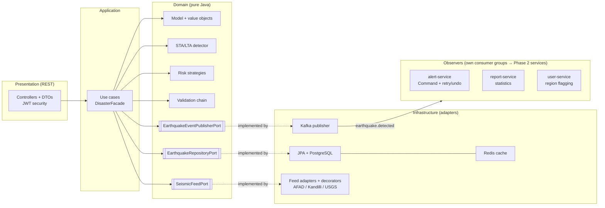

# Earthquake & Disaster Monitoring Platform

Seismic data ingestion, earthquake detection and risk scoring backend, built with
**Spring Boot 3 + Hexagonal Architecture**. Raw station signals are run through an
**STA/LTA detector**; detected events are risk-scored (Strategy), persisted, and
fan-out via Kafka events (Observer). Built around clean architectural seams and ten core
design patterns — Strategy, Factory, Adapter, Observer, Builder, Template Method, Chain of
Responsibility, Command, Decorator and Facade — following SOLID.

**Try it / project docs:** import [`postman_collection.json`](postman_collection.json) or run
[`api.http`](api.http) (log in first — `scientist/science123` — the token is captured
automatically). Design rationale is logged in [`DECISIONS.md`](DECISIONS.md); the Phase 2
microservices split is in the sibling `earthquake-platform` repo
(see its `MICROSERVICES.md`). CI runs build + tests on every push
(`.github/workflows/ci.yml`).

## Architecture (Ports & Adapters)




| Layer | Package | Contains | Knows about Spring/JPA? |
|---|---|---|---|
| Domain | `domain/model`, `domain/port`, `domain/service`, `domain/exception` | `Earthquake` entity, value objects, repository port, **risk-scoring strategies** | **No** — pure Java |
| Application | `application/usecase`, `application/annotation` | one class per use case, commands | Only `@Transactional` + `@UseCase` |
| Infrastructure | `infrastructure/persistence` | JPA entity, Spring Data repo, port adapter (mapping) | Yes |
| Presentation | `presentation/controller` | REST controller, DTOs, exception handler | Yes |

**The key seam:** the domain `Earthquake` and the persistence `JpaEarthquakeEntity`
are two separate classes. `EarthquakeRepositoryAdapter` maps between them. The domain
has zero `@Entity` / Spring annotations, so business rules never depend on infrastructure.

## Run it

```bash
# 1. Start PostgreSQL + Redis + Kafka
docker compose up -d

# 2. Run the app  (Flyway applies migrations on startup)
mvn spring-boot:run
```

App: http://localhost:8080

## API

```bash
# Create
curl -X POST http://localhost:8080/api/earthquakes \
  -H "Content-Type: application/json" \
  -d '{"magnitude":6.4,"depthKm":12.5,"latitude":40.65,"longitude":29.27,
       "source":"AFAD","occurredAt":"2026-06-20T08:30:00Z"}'

# List / get / delete
curl http://localhost:8080/api/earthquakes
curl http://localhost:8080/api/earthquakes/1
curl -X DELETE http://localhost:8080/api/earthquakes/1
```

## Design decisions (the interview answers)

- **Domain != JPA entity** — keeps business rules framework-free; only the adapter touches JPA.
- **Value Objects** (`Magnitude`, `GeoLocation`) — records with validation in the constructor;
  an invalid magnitude cannot exist in the system.
- **One class per use case** — Single Responsibility at the class level.
- **`@Transactional` on the use case** — the application layer is the transaction boundary,
  not the controller (too early) or the domain (must stay pure).
- **DIP via the port** — use cases depend on `EarthquakeRepositoryPort`, never on Spring Data.

## Risk scoring (Strategy Pattern)

When an earthquake is registered it is scored automatically. The algorithm is
selected **at runtime** by magnitude band — Strategy Pattern:

| Strategy | Band | Level |
|---|---|---|
| `LowRiskStrategy` | magnitude < 4.0 | LOW |
| `MediumRiskStrategy` | 4.0 – 5.9 | MEDIUM |
| `HighRiskStrategy` | 6.0 – 7.9 | HIGH |
| `CriticalRiskStrategy` | 8.0+ | CRITICAL |

Each strategy has its own formula (magnitude + depth), so the *algorithm* is
swappable, not just the label. Strategies are **pure domain classes** with no Spring
annotations; `RiskScoringConfig` registers them as beans and `RiskScoringService`
picks the matching one. Adding a new band = new class + one bean line (OCP).

The `POST /api/earthquakes` response now includes `riskScore` (0–100) and `riskLevel`.

## Detection (STA/LTA trigger)

Detection is the front door of the pipeline. `POST /api/detection/analyze` takes a
window of raw ground-motion samples from a station and runs an **STA/LTA detector** —
the standard seismological trigger:

- a **short-term average** (recent energy) and a **long-term average** (background
  noise) slide over the absolute amplitude;
- when `STA/LTA` rises above the trigger ratio, a sudden energy burst has arrived → an
  earthquake is detected at that sample, and its timestamp is `startTime + index / rate`.

A detected event then flows through the rest of the system automatically:
**detect → score (Strategy) → persist → publish (Observer)**. If the window is just
noise, nothing is saved.

The algorithm sits behind an `EarthquakeDetector` interface (so STA/LTA could be
swapped for template-matching or ML), is **pure domain**, and is tuned in
`DetectionConfig` (STA=10, LTA=100, ratio=4.0). Magnitude is a simplified estimate
from peak amplitude (a real one needs station distance + calibration).

```bash
# Analyse a signal window (amplitudes truncated here for brevity)
curl -X POST http://localhost:8080/api/detection/analyze \
  -H "Content-Type: application/json" \
  -d '{"stationId":"STA-YLV","latitude":40.65,"longitude":29.27,
       "sampleRateHz":100,"startTime":"2026-06-21T10:00:00Z",
       "amplitudes":[0.4,-0.3, ... ,38.1,-37.4, ...]}'
# detected -> {"detected":true,"estimatedMagnitude":4.59,"staLtaRatio":5.17,
#              "triggeredAt":"2026-06-21T10:00:05Z","earthquakeId":1,"riskLevel":"MEDIUM"}
# noise    -> {"detected":false, ... ,"earthquakeId":null}
```

## Disaster types (Factory Pattern)

The platform now assesses more than just earthquakes. A `DisasterHandlerFactory`
selects the right handler **at runtime** by disaster type:

| Type | Handler | `intensity` means | Bands |
|---|---|---|---|
| `EARTHQUAKE` | `EarthquakeDisasterHandler` | Richter magnitude (0–10) | <4 / <6 / <8 / 8+ |
| `FLOOD` | `FloodDisasterHandler` | metres above flood stage | <1 / <3 / <5 / 5+ |
| `WILDFIRE` | `WildfireDisasterHandler` | burned area (km²) | <10 / <100 / <500 / 500+ |

Each handler interprets the same `intensity` input with its **own units and
thresholds** — same interface, type-specific logic. All four `RiskLevel`s
(LOW/MEDIUM/HIGH/CRITICAL) are reused so the platform speaks one severity language.

**No `switch` in the factory.** Instead of branching on a type string (which would
have to be edited for every new type), the factory holds the list of handlers and
asks each one whether it `supports` the type — the same self-selecting design as
`RiskScoringService`. Handlers are **pure domain classes**; `DisasterFactoryConfig`
registers them as beans. Adding `TSUNAMI` later = new class + one bean line, and the
factory itself never changes (OCP).

```bash
# Assess a disaster reading
curl -X POST http://localhost:8080/api/disasters/assess \
  -H "Content-Type: application/json" \
  -d '{"type":"WILDFIRE","intensity":600}'
# -> {"type":"WILDFIRE","riskLevel":"CRITICAL","advisory":"Megafire. Declare disaster zone ..."}

# Unknown type fails fast with 400
curl -X POST http://localhost:8080/api/disasters/assess \
  -H "Content-Type: application/json" \
  -d '{"type":"TSUNAMI","intensity":5}'
# -> 400  "Unsupported disaster type: TSUNAMI"
```

> Note: this assessment use case is **not** `@Transactional` — it's a pure
> computation with no DB write, so there's no transaction boundary to open.

## External feeds (Adapter Pattern)

Kandilli, AFAD and USGS each expose a **completely different** raw API. One domain
port, `SeismicFeedPort`, defines what the app needs; one adapter per source
implements it and normalises everything into the domain `Earthquake` model.

| Source | Raw format | What the adapter must absorb |
|---|---|---|
| `UsgsFeedAdapter` | GeoJSON | magnitude under `properties.mag`; coords are `[lon, lat, depth]` (**lon first**); time = epoch millis (UTC) |
| `AfadFeedAdapter` | JSON | separate lat/lon; `eventDate` is zone-less **Turkey local time** → convert to UTC |
| `KandilliFeedAdapter` | fixed-width **plain text** | tokenise columns, skip header, pick best magnitude (**Mw > ML > MD**, `-.-` = missing), parse `yyyy.MM.dd HH:mm:ss` TRT → UTC |

Each adapter is a GoF **object adapter**: it *composes* a raw client (the "adaptee")
and adapts its shape to the `SeismicFeedPort` target — which is also the hexagonal
*driven adapter*. Spring collects all three into a `List<SeismicFeedPort>`, so the
application never names a concrete source. Adding USGS-Europe or EMSC = one new
adapter class; no existing code changes.

```bash
# Preview: pull from ALL sources, normalised to one shape, NOT saved (no DB write)
curl http://localhost:8080/api/feeds/preview

# Import: normalise (Adapter) -> score (Strategy) -> persist (repo adapter)
curl -X POST http://localhost:8080/api/feeds/import
# -> {"imported":7,"bySource":{"USGS":2,"AFAD":2,"Kandilli":3}}
```

This slice ties three patterns together: **Adapter** feeds → **Strategy** scores →
repository (another Adapter) persists.

> The raw clients (`*RawClient`) return canned payloads standing in for the real HTTP
> calls — each has a comment showing where the `RestClient`/`WebClient` request goes.

## Caching (Redis)

Read paths are cached in Redis; writes evict. Cache annotations live on the **use
cases**, next to `@Transactional` — both are cross-cutting concerns at the application
boundary, not business logic.

| Operation | Annotation | Cache |
|---|---|---|
| `GET /{id}` | `@Cacheable("earthquakes", key="#id")` | one entry per id (10 min TTL) |
| `GET /` (list) | `@Cacheable("earthquakeList")` | whole list as one entry (2 min TTL) |
| register | `@CacheEvict("earthquakeList", allEntries)` | new row invalidates the list |
| import | `@CacheEvict("earthquakeList", allEntries)` | bulk insert invalidates the list |
| delete | `@Caching(evict = both)` | drops the id entry **and** the list |

The cached value is the **domain `Earthquake`**, which now implements
`java.io.Serializable` — a JDK interface, not a framework type, so the domain stays
framework-free while Redis's default serializer can store it. `CacheConfig` wires the
`RedisCacheManager` (TTLs, `eq:` key prefix). Caching is proxy-based, so it triggers
because the controller calls the use-case bean (not via self-invocation).

```bash
curl http://localhost:8080/api/earthquakes/1   # 1st call: DB + show-sql logs
curl http://localhost:8080/api/earthquakes/1   # 2nd call: served from Redis, no SQL
# Inspect Redis:  docker exec -it eq-redis redis-cli KEYS 'eq:*'
```

## Database migrations (Flyway)

Hibernate no longer creates the schema. `ddl-auto` is now `validate` — Flyway owns the
DDL and Hibernate only checks the entity mapping matches. Migrations live in
`src/main/resources/db/migration/` (`V1__create_earthquakes.sql`); each runs once and
is recorded in `flyway_schema_history`. Evolving the schema = add `V2__...sql`, never
edit an applied migration.

> `baseline-on-migrate: true` lets Flyway adopt a database that an earlier
> `ddl-auto=update` run may have created. Column types in V1 mirror Hibernate 6.5
> defaults so `validate` passes; if it ever complains about a type, that's schema
> drift — align the SQL with the entity.

## Event flow (Kafka — Observer Pattern)

After an earthquake is saved and scored, an `EarthquakeDetectedEvent` is published to
the `earthquake.detected` topic. Three consumers react **independently** — that's the
Observer Pattern, with Kafka as the event bus:

| Consumer | groupId | Reaction |
|---|---|---|
| `AlertEventListener` | `alert-service` | notify responders if risk is HIGH/CRITICAL |
| `ReportEventListener` | `report-service` | update running statistics |
| `UserRegionEventListener` | `user-service` | flag users in the affected region |

**The key detail: each listener has its own `groupId`.** Distinct groups = fan-out,
so every consumer receives every message. (A shared group would *load-balance* the
messages instead — a great interview distinction.) In Phase 2 each consumer becomes
its own microservice; the code barely changes.

Architecture stays clean: the application publishes through a domain port
(`EarthquakeEventPublisherPort`), and `KafkaEarthquakeEventPublisher` is just another
driven adapter — the use cases never import Kafka. The event itself is a pure domain
record, serialized as JSON on the wire.

```bash
# Import from all feeds -> persist -> publish 7 events
curl -X POST http://localhost:8080/api/feeds/import

# The report consumer's state, built purely from events (watch it grow):
curl http://localhost:8080/api/stats
# -> {"totalEvents":7,"maxMagnitude":7.1,"byRiskLevel":{"LOW":2,"MEDIUM":2,"HIGH":3,"CRITICAL":0}}

# Watch all three consumers react in the app logs ([ALERT]/[REPORT]/[USER] lines).
# Inspect the topic:  docker exec -it eq-kafka /opt/kafka/bin/kafka-console-consumer.sh \
#   --bootstrap-server localhost:9092 --topic earthquake.detected --from-beginning
```

> Publishing happens inside the DB transaction for simplicity. Production would publish
> **after commit** (transactional outbox or `@TransactionalEventListener(AFTER_COMMIT)`)
> so a rolled-back transaction can't leave a phantom event on the topic.

## Security (JWT + role-based access)

The API is stateless and JWT-secured, with three roles from the roadmap: **PUBLIC**,
**SCIENTIST**, **ADMIN**. `POST /api/auth/login` checks credentials and returns a signed
token; every other call carries it as `Authorization: Bearer <token>`.

| Area | PUBLIC | SCIENTIST | ADMIN |
| --- | --- | --- | --- |
| Read earthquakes / reports / stats / feed preview | ✅ | ✅ | ✅ |
| Detection, disaster assessment, monitoring cycle, feed import, create earthquake | — | ✅ | ✅ |
| Delete earthquake | — | — | ✅ |

Open without a token: login, Swagger UI, `/v3/api-docs`, and `/actuator/health|info`.
Demo logins: `admin/admin123`, `scientist/science123`, `viewer/viewer123`.

The JWT itself (HS256) is implemented on the **JDK alone** — `javax.crypto.Mac` for the
signature and `Base64` URL encoding — so there's no third-party JWT dependency. `JwtService`
signs and verifies (signature + expiry) and is covered by unit tests; `JwtAuthenticationFilter`
turns a valid token into a `ROLE_*` authority, and `SecurityConfig` holds the access rules.
Set a real secret via the `JWT_SECRET` env var in any deployment.

## Observability (Actuator + Micrometer)

Spring Boot Actuator exposes `health`, `info`, `metrics` and a Prometheus scrape endpoint
(`/actuator/prometheus`, via micrometer-registry-prometheus). `health` and `info` are public
for load-balancer/uptime probes; the rest require authentication.

## Roadmap

Phase 1 (monolith, all core patterns) — **complete**:

- ~~Strategy Pattern for risk scoring by magnitude~~ ✅
- ~~Factory for disaster types (earthquake / flood / wildfire)~~ ✅
- ~~Adapter Pattern for Kandilli / AFAD / USGS feeds behind one port~~ ✅
- ~~Redis caching~~ ✅
- ~~Flyway migrations~~ ✅
- ~~Kafka event flow (Observer Pattern)~~ ✅
- ~~Builder Pattern for the immutable `SeismicReport`~~ ✅
- ~~Template Method for report rendering (text / markdown)~~ ✅
- ~~Chain of Responsibility for raw-signal validation~~ ✅
- ~~Command for alert actions (retry + undo / rollback)~~ ✅
- ~~Decorator for raw-feed conditioning/enrichment~~ ✅
- ~~Facade over the whole monitoring flow~~ ✅

Next (Phase 2): split the consumers into independent microservices, then containerise and
deploy. All Phase 1 design patterns are now in place.

- ~~Phase 2: split alert/report/user consumers into independent services (+ API gateway,
  config server, service discovery)~~ ✅ — see the `earthquake-platform` repo.

Production maturity:

- ~~OpenAPI / Swagger UI~~ ✅
- ~~Spring Security + JWT with role-based access (Admin / Scientist / Public)~~ ✅
- ~~Actuator + Micrometer (health, metrics, Prometheus)~~ ✅

Deployment & docs:

- ~~Dockerfile + single `docker-compose` for the whole stack~~ ✅
- ~~Mermaid architecture diagram, DECISIONS.md (ADR log)~~ ✅
- ~~Runnable `api.http` + Postman collection~~ ✅
- ~~GitHub Actions CI (build + tests, image build)~~ ✅
- Cloud deploy (e.g. AWS ECS/EKS) — not done yet.

### Raw-feed conditioning (Decorator Pattern)

Every source's raw output is passed through the same stack of decorators before it reaches
the pipeline. Each decorator <i>is</i> a `SeismicFeedPort` and <i>wraps</i> one, so they
stack transparently and the import/preview use cases keep depending only on the port:

```
raw adapter → MinMagnitude (drop noise) → DepthDefaulting (enrich) → Deduplicating
```

| Decorator | Effect |
| --- | --- |
| `MinMagnitudeFeedDecorator` | drops sub-threshold micro-quakes |
| `DepthDefaultingFeedDecorator` | fills a missing/zero depth with a regional default (enrichment) |
| `DeduplicatingFeedDecorator` | collapses repeats sharing time/magnitude/location |

The adapters are no longer `@Component`-scanned individually; `FeedConfig` constructs each
one and wraps it in the stack, exposing the three decorated feeds. Adding a layer = a new
decorator + one line in the wrapping order.

### One entry point (Facade Pattern)

The workflow is spread across several use cases (import, report, detect, assess), each
with its own dependencies and transaction rules. `DisasterFacade` gives callers one object
that hides that surface — most usefully `runMonitoringCycle()`, which puts the whole "pull
every feed, then summarise" flow behind a single method (`POST /api/monitoring/cycle`). The
facade adds no business logic; it only coordinates, and the use cases stay independently
usable, so it stays a convenience layer rather than a god object.

### Alert actions (Command Pattern)

The alert consumer no longer performs alerts inline; it is the Command pattern's
**client**. For each detected event it builds the right command objects and hands them to
the `AlertDispatcher` (the **invoker**), which adds two behaviours the bare actions don't
have:

- **Retry** — a command's `execute()` is attempted up to a configured number of times, so
  a transient channel failure doesn't drop an alert.
- **Undo / rollback** — `dispatchBatch(...)` runs a group atomically; if any command fails
  after its retries, every command already executed in the batch is undone (`undo()`) in
  LIFO order before the error is rethrown, so an alert batch never lands half-applied.

| Command | Triggered by | `undo()` |
| --- | --- | --- |
| `NotifyRespondersCommand` | HIGH or CRITICAL | retracts the page |
| `BroadcastPublicWarningCommand` | CRITICAL | issues a stand-down |
| `LogBelowThresholdCommand` | below threshold | no-op (a note isn't unwritten) |

The actual side effect goes through an `AlertChannel` (the **receiver** port);
`LoggingAlertChannel` is the current implementation — swapping in real SMS/push/siren is a
new channel with no change to any command. The dispatcher holds no mutable state (only the
retry count), so the single bean is safe across concurrent events. All magnitudes are
formatted with `Locale.US`, so an alert reads `M6.4`, never `M6,4`.

### Signal validation (Chain of Responsibility Pattern)

A raw `SeismicSignal` may be well-formed (the DTO's bean validation already guarantees
that) yet still be useless to the detector — too short for the STA/LTA window, a flat
dead channel, clipped at the rail, or carrying `NaN` samples. A chain of single-rule
validators runs just before detection; each link either accepts and passes the signal on,
or rejects (throwing `SignalRejectedException`, mapped to **HTTP 422**) and short-circuits
the rest:

| Order | Link | Rejects when |
| --- | --- | --- |
| 1 | `FiniteAmplitudeValidator` | any sample is `NaN`/`Infinity` |
| 2 | `WindowLengthValidator` | fewer samples than the detector's LTA window needs |
| 3 | `DeadChannelValidator` | the trace is flat (std dev ≈ 0) |
| 4 | `ClippingValidator` | too many samples pinned at the peak (saturation) |

`SignalValidator.validate()` is `final` — it runs the link's own `check()` then delegates
to the next link, so subclasses can't break the "check, then pass on" mechanic. The chain
is assembled explicitly in `SignalValidationConfig` (`head.linkTo(b).linkTo(c)…`), so the
order reads top to bottom; adding a rule = a new validator + one `linkTo` line.

### Report rendering (Template Method Pattern)

The immutable `SeismicReport` (built by the Builder) is poured into different text
formats through one fixed skeleton. `ReportRenderer.render()` is `final` and locks the
step order — **header → summary → body → footer**, with an empty report taking a
separate branch — while subclasses decide only *how* each step is written:

| Renderer | Format | `GET /api/reports/render?format=` |
| --- | --- | --- |
| `PlainTextReportRenderer` | `text/plain` | `text` (default) |
| `MarkdownReportRenderer` | `text/markdown` | `markdown` |

`ReportRendererFactory` self-selects the renderer by format (same OCP shape as
`DisasterHandlerFactory`); adding a format = one subclass + one bean line in
`ReportRendererConfig`. All number formatting is pinned to `Locale.US`, so a value like
`4.80` never silently becomes `4,80` on a Turkish-locale JVM.
