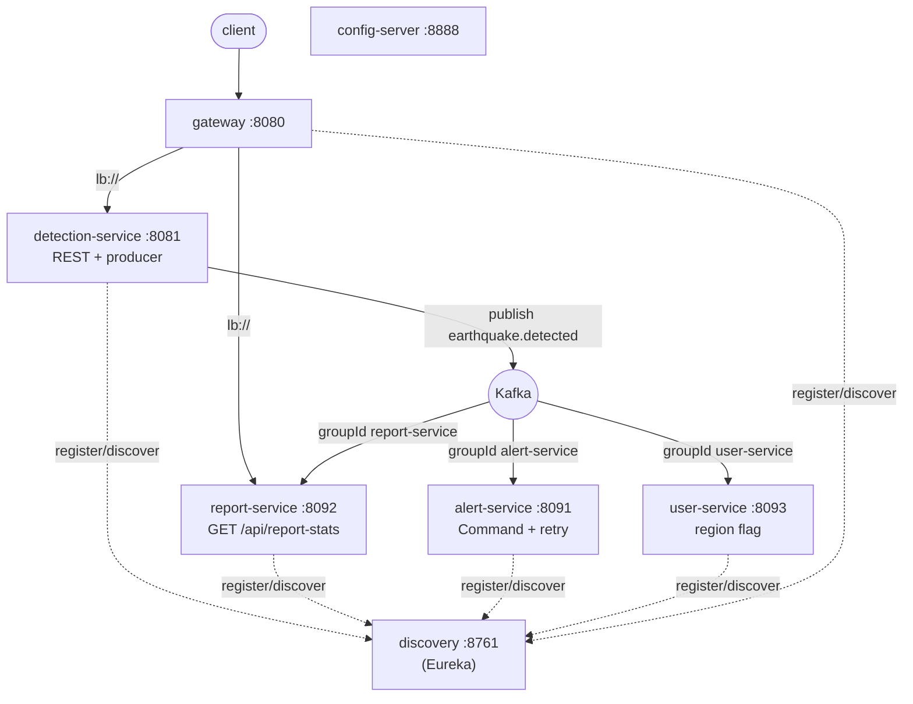

# Phase 2 — Microservices

The monolith's three Kafka consumers are split into independent services. The detection
core stays as the **producer**; the consumers become their own deployables. Because the
event already travels over Kafka, the consumer code moved out almost unchanged — the
groupIds (`alert-service`, `report-service`, `user-service`) are identical, so offsets and
fan-out semantics carry over. Service discovery, a config server and an API gateway are
layered on top.

## Topology



## Modules / ports

| Module | Role | Port | HTTP API |
| --- | --- | --- | --- |
| `eq-events` | shared event contract (no framework) | — | — |
| `eq-discovery` | Eureka service registry | 8761 | dashboard |
| `eq-config-server` | Spring Cloud Config (native) | 8888 | config |
| `eq-gateway` | API gateway, routes via `lb://` | 8080 | all public routes |
| `eq-detection-service` | producer + REST core (former monolith) | 8081 | earthquakes, reports, detection, auth… |
| `eq-alert-service` | alert reaction (Command, retry, rollback) | 8091 | none (pure consumer) |
| `eq-report-service` | running statistics | 8092 | `GET /api/report-stats` |
| `eq-user-service` | flags users in affected region | 8093 | none (pure consumer) |

## Why the split was cheap

Each consumer depended only on the **event** plus its own small collaborators (the alert
Command machinery; the report statistics). None shared a database with the producer, so
each became a standalone Spring Boot app that depends on one tiny library, `eq-events` —
not on the other services.

## Event interop (no producer change needed)

`eq-events` defines the canonical `EarthquakeDetectedEvent` (same field names/types as the
JSON the monolith already publishes). The consumers configure their Kafka deserializer to
**ignore the producer's `__TypeId__` header** and map the JSON onto the shared type:

```yaml
spring.kafka.consumer.properties:
  spring.json.use.type.headers: false
  spring.json.value.default.type: com.afet.platform.events.EarthquakeDetectedEvent
  spring.json.trusted.packages: com.afet.platform.events
```

So the consumer services work against the monolith's existing output with zero change to
the producer's wire format.

## Migrating the monolith → detection-service — done (via the `platform` profile)

The migration is no longer a manual checklist; it is committed in the monolith and toggled
by one Spring profile:

1. **Cloud-routable.** The monolith pom ships the Spring Cloud BOM +
   `spring-cloud-starter-netflix-eureka-client` + `spring-cloud-starter-config`. They are
   dormant by default (`eureka.client.enabled=false`), so the standalone monolith still runs
   with no registry or config server.
2. **No double-handling.** The three in-monolith listeners and their support beans
   (`ReportStatistics`, `StatsController`, `LoggingAlertChannel`, `AlertDispatcherConfig`)
   are `@Profile("!platform")` — present standalone, switched off in the platform where the
   dedicated services own those reactions. (No code was deleted, so the monolith stays a
   complete app on its own.)
3. **Profile + broker.** `docker-compose.yml` runs the detection-service container with
   `SPRING_PROFILES_ACTIVE=platform` and `SPRING_KAFKA_BOOTSTRAP_SERVERS=kafka:19092`, plus
   `EUREKA_URL` / `CONFIG_SERVER_URL`.

The detection-service build context in `docker-compose.yml` points at `../earthquake-monitoring`
(the monolith repo sitting next to this one).

## Run it

```bash
mvn -q -DskipTests package        # build all platform modules
docker compose up --build         # infra + discovery + config + gateway + services
```

Then: Eureka dashboard at http://localhost:8761, gateway at http://localhost:8080,
report stats via the gateway at http://localhost:8080/api/report-stats.

## What is verified vs. standard wiring

- **Verified offline** (compiled + run): `eq-events` compiles; the alert-service Command
  package compiles against `eq-events` and its logic was unit-proven in Phase 1 (retry,
  rollback, undo, locale-safe formatting).
- **Standard wiring, not compiled here**: the Spring Cloud pieces (gateway, Eureka, config
  client) and the `@KafkaListener` consumers need Spring Cloud / Boot dependencies from
  Maven Central, which wasn't reachable in this environment. They follow the standard
  Spring Cloud 2023.0.x idiom; build them with `mvn package` where Central is reachable.
